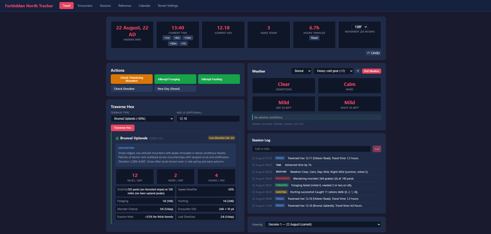

# Forbidden North Tracker

A campaign management tool for the **Gods of the Forbidden North** tabletop RPG setting. Track hex-crawl travel, encounters, weather, sessions, and calendar time — all in one place.



## Features

- **Hex Travel** — Track party movement across terrain hexes with speed modifiers and getting-lost checks
- **Encounter Tables** — Per-terrain random encounter tables with dice rolling
- **Session Management** — Log events, take notes, and review session history
- **Calendar System** — Custom in-world calendar with configurable months and seasons
- **Weather** — Weather generation tied to terrain and season
- **Terrain Database** — Detailed terrain types with foraging, hunting, fishing, and visibility data

---

## For Players

Download the standalone binary for your platform from the [Releases](../../releases) page:

| Platform | File |
|----------|------|
| Windows  | `forbidden-north-tracker-*-win.exe` |
| macOS    | `Forbidden-North-Tracker-*-mac.zip` |

### Running

1. Download the file for your OS
2. **Windows**: Double-click the `.exe` file
3. **macOS**: Unzip the `.zip` file, then double-click **Forbidden North Tracker.app**. On first launch, macOS will block it — right-click the app and choose **Open**, then click **Open** in the dialog.
4. Your browser will open automatically to `http://localhost:3000`
5. To stop the server, close the terminal window or press `Ctrl+C`

### Troubleshooting

- **"Address already in use" error**: A previous instance is still running. On Windows, open Command Prompt and run `netstat -ano | findstr :3000` to find the PID, then `taskkill /F /PID <pid>`. On macOS, run `lsof -ti:3000 | xargs kill -9`.
- **Seeing old data after an update**: Delete the `forbidden_north.db` file next to the executable to start fresh. This will erase all campaign data — back it up first if needed.

### Where is my data?

The SQLite database (`forbidden_north.db`) is stored in the same folder as the executable. Back up this file to preserve your campaign data.

---

## For Developers

### Prerequisites

- Node.js 18+
- npm

### Setup

```bash
git clone <repo-url>
cd gotfn_tracker
npm install
```

### Development

```bash
make dev        # Start dev server + Vite client (hot reload)
make server     # Server only
make client     # Client only
make test       # Run tests
```

The dev server runs at `http://localhost:5180` (Vite proxy → Express on port 5175).

### Project Structure

```
server/
  index.js          Express server entry point
  db.js             SQLite database setup + migrations
  routes/           API route handlers
  data/             Seed data (terrains, calendar)
  tests/            Node.js test runner tests
src/                React frontend (Vite)
scripts/
  build-standalone.mjs   Build orchestration for standalone binaries
  standalone-wrapper.cjs  CJS entry point for packaged binary
dist/               Built frontend (generated by vite build)
build/              Intermediate build artifacts (generated)
release/            Standalone binaries (generated)
```

### Building Standalone Binaries

```bash
npm run build:standalone:win
npm run build:standalone:mac
```

The binary is written to `release/`.

**Note**: Native addons (better-sqlite3) must be compiled on the target platform. Cross-compilation is not supported — use CI (see below) or build on each OS directly.

### How the Standalone Build Works

1. **Vite** builds the React frontend into `dist/`
2. **esbuild** bundles all server ESM code into a single CJS file (`build/server.cjs`), with `better-sqlite3` marked as external (it's a native addon)
3. A CJS wrapper (`standalone-wrapper.cjs`) handles standalone-specific behavior: database path, auto-opening the browser
4. **@yao-pkg/pkg** packages the wrapper + bundled server + frontend assets into a single executable

### CI / Releases

Push a version tag to trigger the GitHub Actions release workflow:

```bash
git tag v1.0.0
git push origin v1.0.0
```

This builds binaries on macOS and Windows runners and uploads them as GitHub Release assets.
